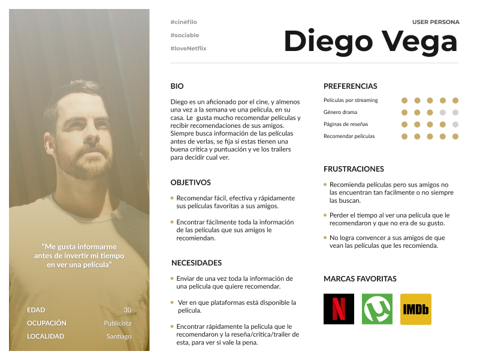
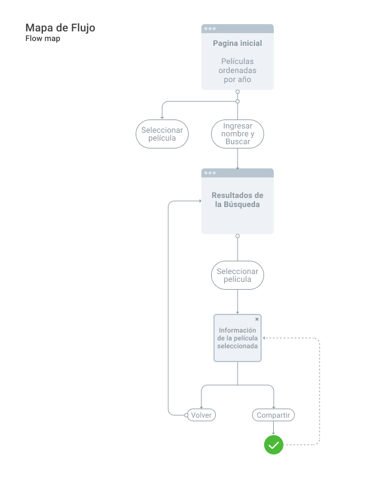
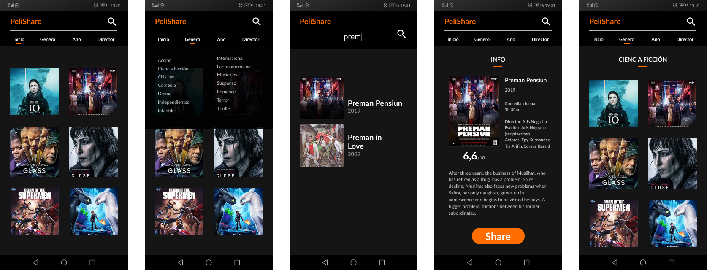

# **"PeliShare" Proyecto Hackathon**
## **Índice**

- Preámbulo
- Definición de usuario
  - Encuestas
  - Usuario (User persona)
  - Historias de Usuario y Definition of Done
- Definición del producto
    - Experiencia
    - Planificación
    - Mapa de flujo
    - Referente
    - Prototipo de baja Fidelidad
    - Prototipo de mediana Fidelidad
- Desarrollo de Interfaz UI
  - Mobile First
  - Flujo de Usabilidad
  - Evaluación Heurística
  - Prototipo de escritorio

  -----------------------------

## **Preámbulo**

  "PeliShare" es una plataforma para personas que gustan compartir sus intereses cinéfilos, recomendando o recibiendo recomendaciones de películas. La plataforma permite revisar las criticas y calificaciones de las recomendaciones recibidas para que el usuario pueda tomar la decisión de verla con seguridad. También permite recomendar tus películas favoritas con todo el contenido que tus amigos necesitan ver para convencerse de que vale la pena ver tu recomendación. 

## **Definición del Usuario**
-----------------------------
## **Encuestas**

Con más respuestas de la encuesta compartida, se volvió a hacer un análisis de los resultados, concluyendo lo siguiente sobre el usuario promedio:

- La edad promedio es de entre 27 a 32 años.
- Bien podria ser un hombre o una mujer.
- Se condisera un aficionado por el cine.
- Ve peliculas por streaming almenos una vez a la semana.
- Utiliza principalmente Netflix y Torrent.
- Se informa viendo reseñas, criticas y trailers de las películas antes de verlas.
- Le gusta recomendar películas y considera mucho las recomendaciones de sus cercanos.

## **Usuario (User persona)**
Basandonos en los resultados de la encuesta y las conclusiones sobre el usuario promedio, se definió el siguiente User persona.

## **Historias de Usuario y Definition of Done**

Luego de haber definido nuestro Usuario y teniendo sus Necesidades, se trabajarán las siguientes historias de usuario con sus respectivos DoD, los cuales nos ayúdaran en nuestra planificación y desarrollo del prototipo:

**Historia de Usuario 1**

|         COMO   |QUIERO                         |PARA                         |
|----------------|-------------------------------|-----------------------------|
|Fanático del cine |` compartir de forma simple mis peliculas favoritas` |que mis amigos puedan acceder facilmente a ver de que trata|

**Criterios de aceptación**
- [x] Compartir link desde la ficha de la película
- [x] Compartir apretando un botón
- [x] Una persona recibe link

**Definition of Done**

Busqueda por nombre
- [x] Botón de compartir
- [x] Opciones de compartir (whatsapp, messenger, mail, twitter)
- [x] Aviso de "mensaje de enviado"

**Historia de Usuario 2**

|         COMO   |QUIERO                         |PARA                         |
|----------------|-------------------------------|-----------------------------|
|Persona a quien le recomiendan películas |`ver sus reseñas y calificaciones` |decidir si vale la pena verlas|

**Criterios de aceptación**
- [x] Escribir un nombre y recibir películas con ese nombre
- [x] Ingresar a la película buscada
- [x] Ver reseña
- [x] Ver calificación
- [x] Ver trailer

**Definition of Done**

- [x] Buscador de películas por nombre (input)
- [x] Butón submit
- [x] Ver tarjetas de peliculas sugeridas
- [x] Ver tarjeta de pelicula buscada
- [x] Mostrar información de la película al hacer click

**Historia de Usuario 3**

|         COMO   |QUIERO                         |PARA                         |
|----------------|-------------------------------|-----------------------------|
|Persona a quien le gusta recomendar películas|`mostrar una reseña formal y convincente` |convencer a mis amigos de ver una película|

**Criterios de aceptación**
- [x] Enviar link de la página
- [x] Enviar reseña formal

**Definition of Done**

- [x] Mostrar imagen de la película
- [x] Mostrar nombre
- [x] Año de estreno
- [x] Calificación
- [x] Reseña
- [x] Género
- [x] Trailer
- [x] Comentarios de otras personas

-----------------------------

## **Planificación**

> La planificación de este Sprint está en el siguiente link de [Trello](https://trello.com/b/xJ7p1rg9/hackatón).

-----------------------------

# **Definición del producto**

## **Mapa de flujo**

Al tener los Definition of Done, o requerimientos de la plataforma, se trabajó un mapa de flujo, para guiarnos en la usabilidad.

## **Referente visual y de Usabilidad**

## **Prototipo de baja Fidelidad**

> Prototipo interactivo desarrollado en [Figma](https://www.figma.com/proto/GO6JCElExYM7I7KUHOquL1YF/Prototipo-Hackaton?node-id=1%3A865&scaling=contain).

## **Prototipo de mediana Fidelidad**

## **Desarrollo de Interfaz UI**
-----------------------------

## **Mobile First**

## **Versión escritorio**

> Prototipo interactivo desarrollado en [Figma](https://www.figma.com/file/TDjybkMBDH19fLqT3IDvENih/Prototipo-PeliShare?node-id=0%3A1).

